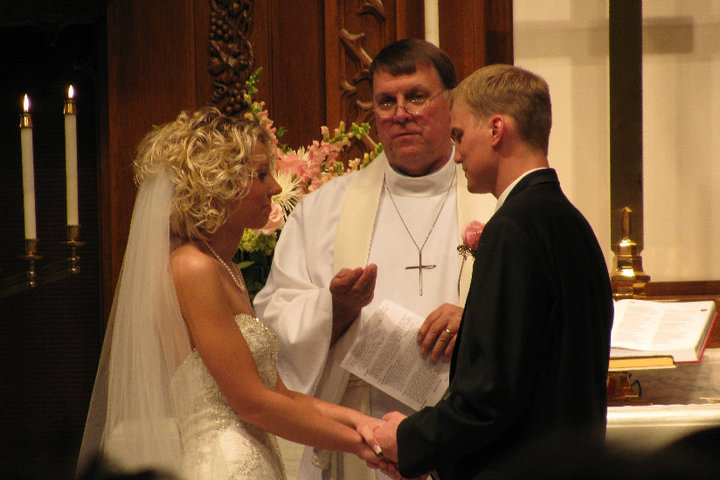
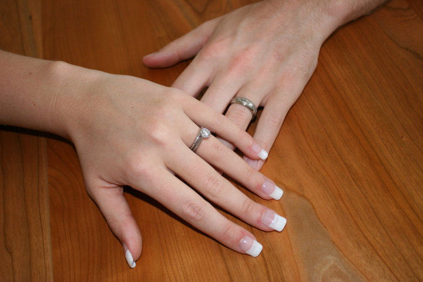

# Bridal Shower Recipe Collection

  

This collection features handwritten recipe cards gathered at my 2010 bridal shower. Each recipe was contributed by family and friends as a gift, making the collection both personal and meaningful. Beyond the recipes themselves, the cards preserve handwriting, memories, and the relationships behind each contribution.

## How to Use This Collection

You can explore the collection by browsing recipes, searching by keyword, or filtering by subject and dish type. Users may choose to look for a specific recipe, compare different types of dishes, or simply browse to discover the variety of contributions.

[Browse the Collection](browse.html)

## About This Collection

Unlike traditional recipe collections organized by cuisine or ingredient, this collection is centered around a single life event. Each recipe reflects a connection between the contributor and the bride, offering insight into how food is shared as part of social traditions and celebrations.

  

## Why It Matters

These recipes are more than cooking instructions—they are expressions of care, identity, and memory. Together, they document how everyday knowledge, like cooking, is passed between people and preserved through meaningful moments.

